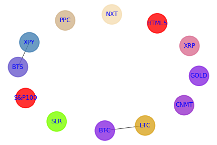
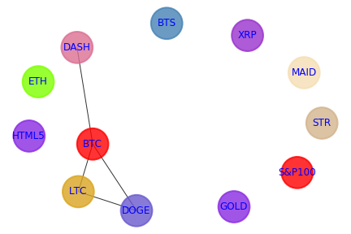

[](http://quantlet.de/)

## [](http://quantlet.de/) **CCMAX_full** [](http://quantlet.de/)

```yaml

Name of Quantlet:  CCMAX_full
 
Published in:      ""
  
Description:       Produces plots based on historical hf CRIX data (CRIX Plot, CRIX Volatility and Cryptocurrency Correlations)
 
Keywords:          CRIX, plot, time-series, financial, crypto, graphical representation, data visualization

See also :         crix, econ_arima, econ_crix, econ_garch, econ_vola

Author:            Alla Petukhina, Raphael Reule
  
Submitted:         Wed, December 23 2017 by Raphael Reule
  
Datafile:          data sourced from online CRIX json files and historic data provided


  

```






### R Code
```r

setwd("~/Documents/PYTH/PythiaR/CTD_CRIX_Correlations")

# install and load packages
libraries = c("readxl", "xtable", "igraph", "zoo","igraph", "xts")

lapply(libraries, function(x) if (!(x %in% installed.packages())) {
  install.packages(x)
})
lapply(libraries, library, quietly = TRUE, character.only = TRUE)

## Load data
# Traditional assts
TRAD_ASSETS            = data.frame(read_excel
                                    ("~/Documents/PYTH/PythiaR/CTD_CRIX_Correlations/20171108Traditional_assets_indices_20130101_20171101.xlsx",
                                      sheet ="Sheet3"))
TRAD_ASSETS$Date       = as.Date(TRAD_ASSETS$Date)
row.names(TRAD_ASSETS) = as.Date(TRAD_ASSETS$Date)
TRAD_ASSETS$Date = NULL
#CC prices, capitalization and volume
CAP                    = read.delim("CC_CAP_20140101_20161231.txt",sep =";")
PRICE                  = read.delim("CC_PRICE_20140101_20161231.txt",sep =";")

VOLUME                 = read.delim("CC_VOLUME_20140101_20161231.txt",sep =";")
CAP$Date               = as.Date(CAP$date,  origin ="1899-12-30")
CAP                    = CAP[ order(CAP$Date), -1]
row.names(CAP)         = CAP$Date
CAP$Date               = NULL
CAP                    = CAP[row.names(CAP)>as.Date("2013-12-31")&row.names(CAP)<as.Date("2017-01-01"),]
PRICE$Date             = as.Date(PRICE$date,  origin ="1899-12-30")
PRICE                  = PRICE[ order(PRICE$Date), -1]
row.names(PRICE)       = PRICE$Date
PRICE$Date             = NULL
VOLUME$Date = as.Date(VOLUME$date,  origin ="1899-12-30")
VOLUME      = VOLUME[ order(VOLUME$Date), -1]
PRICE       = PRICE[row.names(PRICE)>as.Date("2013-12-31")&row.names(PRICE)<as.Date("2017-01-01"),]
colnames(PRICE) = toupper(colnames(PRICE))
colnames(CAP) = toupper(colnames(CAP))
years = unique(format(as.Date(rownames(PRICE)), "%Y"))
#Build yearly prices TS
CC_data = list()

for (year in years) {
#year = years[1]
  #Data by year
 
  CC_data$PRICE[[year]] =  PRICE[format(as.Date(rownames(PRICE)),"%Y")==year,]
  CC_data$CAP[[year]] =  CAP[format(as.Date(rownames(CAP)),"%Y")==year,]
  CC_data$VOLUME[[year]] =  VOLUME[format(as.Date(rownames(PRICE)),"%Y")==year,]
  CC_data$max_cc[[year]] = tail(sort(apply(CC_data$CAP[[year]],2,mean,na.rm=T)),10)
  CC_data$CC_PRICE_max[[year]] = subset(CC_data$PRICE[[year]], select=names(CC_data$max_cc[[year]] ))
  CC_data$TRAD_CC_PRICE_max[[year]] = merge(CC_data$CC_PRICE_max[[year]],
                                            TRAD_ASSETS[format(as.Date(rownames(TRAD_ASSETS)),"%Y")==year,],
                                            by='row.names')[,-1]
  CC_data$PRICE_max_without_na[[year]] = na.locf(CC_data$TRAD_CC_PRICE_max[[year]])
  CC_data$PRICE_max_xts[[year]] = xts(CC_data$PRICE_max_without_na[[year]], 
                                      order.by = as.Date(row.names(CC_data$PRICE[[year]])))
  CC_data$RET_max_xts[[year]]  = diff(log(CC_data$PRICE_max_xts[[year]]), na.pad=TRUE)
  CC_data$COR_MAT[[year]] = data.frame(cor(CC_data$RET_max_xts[[year]][,c(1:10, 14, 22)],
                                           use ="pairwise.complete.obs"))
  COR_MAT_graph = CC_data$COR_MAT[[year]]
  COR_MAT_graph[ abs(CC_data$COR_MAT[[year]]) < .5 ] = 0
  diag(COR_MAT_graph) = 0
  CC_data$COR_MAT_graph[[year]] =  COR_MAT_graph
  #graph = graph.adjacency(COR_MAT_graph, weighted=TRUE, mode="lower")

}

       
# For whole period
max_cryptos = apply(CAP,2,mean,na.rm=T)
max_cryptos = tail(sort(max_cryptos),10)
PRICE_max = subset(PRICE, select=names(max_cryptos))
TRAD_CC_PRICE_max = merge(PRICE_max, TRAD_ASSETS, by='row.names')[,-1]
#Cleaning NaN
PRICE_without_na  = na.locf(PRICE)
PRICE_max_without_na = na.locf(TRAD_CC_PRICE_max)
#XTS creation
PRICE_xts = xts(PRICE_without_na, order.by = as.Date(row.names(PRICE)))
PRICE_max_xts = xts(PRICE_max_without_na, order.by = as.Date(row.names(PRICE_max)))
# Returns
RET_xts  = diff(log(PRICE_xts), na.pad=TRUE)
RET_max_xts  = diff(log(PRICE_max_xts), na.pad=TRUE)
#######Tables and plots 
color = c("red3","blue3","darkorchid3","goldenrod2","chartreuse4", 
          "palevioletred4","steelblue3","slateblue4","tan4","black")
for (year in years) {
  COR_MAT_graph = as.matrix(CC_data$COR_MAT_graph[[year]])
  graph = graph.adjacency(COR_MAT_graph, weighted=TRUE, mode="lower")
  clp = cluster_label_prop(graph)
  table = xtable(as.data.frame(CC_data$COR_MAT[[year]]))
  print(table, type ="latex", file =paste("CORR",year,".tex"))
  pdf(file =paste("CORR",gsub(" ", "", year, fixed = TRUE),".pdf"))
  plot(clp,graph,col=color[clp$membership], mark.groups = clp, 
       vertex.size = 10,vertex.label.cex = 1,vertex.label.dist=2,
       mark.border="black",vertex.label.degree=0,
       mark.col = NA,vertex.label=rownames(CC_data$COR_MAT[[year]]))
  dev.off()
}

       
# Rolling window correlation
window_length = 180

mean_sd_window_comp = function(dat, w_l) {
  
  if (length(na.omit(dat)) - w_l < 0) {
    return(NA)
  }
  
  startdate   = index(head(dat[! is.na(dat)], 1))
  dat         = dat[paste0(startdate,"::")]
  
  enddates    = index(dat)[-(1:w_l)]
  mean_w      = xts(rep(NA, length(dat) - w_l), order.by=enddates)
  sd_w        = xts(rep(NA, length(dat) - w_l), order.by=enddates)
  corr_w      = xts(rep(NA, length(dat) - w_l), order.by=enddates)
  for (enddate in enddates) {
    enddate         = as.Date(enddate)  # R for loop breaks class
    startdate       = enddate - w_l
    daterange       = paste0(startdate,"::", enddate)
    mean_w[enddate] = mean(dat[daterange], na.rm=TRUE)
    sd_w[enddate]   = sd(dat[daterange], na.rm=TRUE)
    #corr_w[enddate] = cor(dat[daterange], use ="pairwise.complete.obs")
  }
  return(cbind(mean_w,mean_w))
}

mean_sd_list = list()
for (crypto in names(max_cryptos)){
  mean_sd_list[[crypto]] = mean_sd_window_comp(RET_max_xts[, crypto], window_length)
}


names(color)    = names(max_cryptos)

       for (j in 1:length(names(max_cryptos))) {
         pdfname =  paste("Mean moving window 180",gsub(" ", "", names(max_cryptos)[j], fixed = TRUE),".pdf")
         pdf(file = pdfname)
         plot(zoo(mean_sd_list[[j]][, 1]), type ="l", col = color[j], lwd = 3, 
              main = paste("Means in rolling windows: ", 
                           gsub(" ", "", names(max_cryptos)[j], fixed = TRUE)), 
              ylab ="mean log returns")
         dev.off()
         pdfname2 =  paste("Volatility moving window 180",gsub(" ", "", names(max_cryptos)[j], fixed = TRUE),".pdf")
         pdf(file = pdfname2)
         plot(zoo(mean_sd_list[[j]][, 1]), type ="l", col = color[j], lwd = 3, 
              main = paste("Standart deviation in rolling windows: ", 
                           gsub(" ", "", names(max_cryptos)[j], fixed = TRUE)), 
              ylab ="mean log returns")
         dev.off()
       }
      
       
# Build and save as pdf Bar plot for standart deviation/volatility
StD_max = apply(RET_max_xts[,c(1:10, 14, 22)], 2, function(x){sd(x, na.rm = T)})
pdf(file = "Volatility_max.pdf")
barplot(StD_max, col = "red3", border = F)
dev.off()

       
# Build and save as pdf Bar plot for Sharpe ratios
Sharpe_max = apply(RET_max_xts[,c(1:10, 14, 22)], 2, function(x){mean(x, na.rm = T)/sd(x, na.rm = T)})
pdf(file = "SHARPE_max.pdf")
barplot(Sharpe_max, col = "blue3", border = F)
dev.off()

       
#Save data
save.image(file = "CC_MAX.RData")

```

automatically created on 2018-09-04