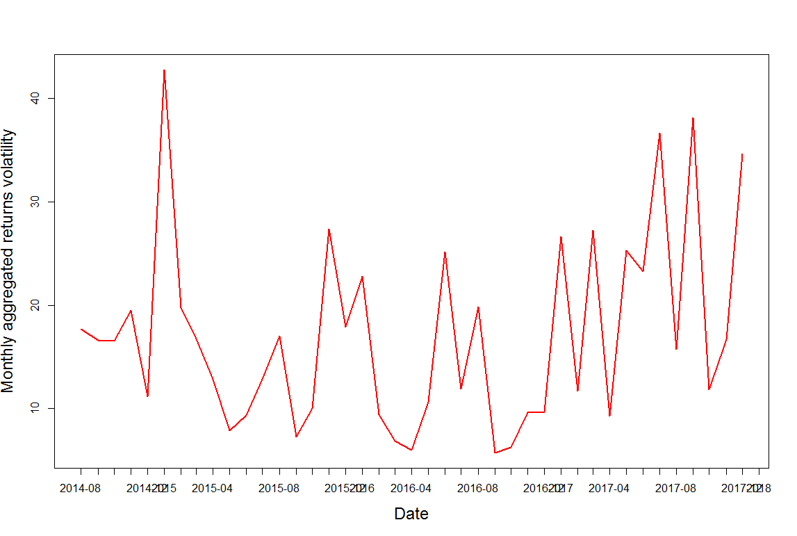

[](http://quantlet.de/)

## [](http://quantlet.de/) **CRIX_Volatility_28122017** [](http://quantlet.de/)

```yaml

Name of Quantlet:  CRIX_Volatility_28122017
 
Published in:      ""
  
Description:       Produces volatility plots based on historical hf CRIX data
 
Keywords:          CRIX, plot, time-series, financial, crypto, graphical representation, data visualization, volatility

See also :         crix, econ_arima, econ_crix, econ_garch, econ_vola

Author:            Alisa Kolesnikova (CRIX Data), Alla Petukhina (Crypto Data)
  
Submitted:         Wed, December 23 2017 by Raphael Reule
  
Datafile:          data sourced from online CRIX json files and historic data provided


  

```



### R Code
```r

# 1. plot of CRIX

require(jsonlite)
require(zoo)
crix <- read.csv("crixdata.csv", header=TRUE, sep=";")
crix$date = as.Date(crix$date)

returns= data.frame(date = as.yearmon(crix$date[-1], "%y-%m"), returns = diff(log(crix$price)))
agg.month= aggregate(returns ~ date, returns, sd)
agg.days = aggregate(returns ~ date, returns, length)
agg.month$days=agg.days$returns
agg.month$date=as.Date(agg.month$date)
colnames(agg.month)=c("date", "month.std", "days")
agg.month$monthlyvola=sqrt(agg.month$days)*agg.month$month.std*100

plot(agg.month$date, agg.month$monthlyvola, type = "l", col = "red",lwd = 2, xlab = "Date",
     ylab = "Monthly aggregated returns volatility", cex.lab = 1.5)
axis(1,at=agg.month$date,labels=format(agg.month$date,"%Y-%m"),las=1)


### Alternative

require(jsonlite)
require(curl)
json_file <- "http://crix.hu-berlin.de/data/crix.json"
crix <- fromJSON(json_file)
crix$date <- as.Date(crix$date)
plot(crix, type = "l", col = "blue3", lwd = 3, xlab = "Date", ylab = "Performance of CRIX", cex.lab = 2)


require(zoo)
#getting returns
ret.table = data.frame(date = crix$date[-1], returns = diff(log(crix$price)))
ret.table$MY = as.yearmon(ret.table$date, "%y-%m")
aggr.month.returns = aggregate(returns ~ MY, ret.table, sd)
aggr.month.returns$returns=aggr.month.returns$returns-mean(aggr.month.returns$returns)
aggr.month.returns$MY=as.Date(aggr.month.returns$MY)

plot(aggr.month.returns, type = "l", col = "steelblue", xaxt="n", lwd = 3, xlab = "Date", 
     ylab = "Monthly aggregated returns volatility")
axis(1,at=aggr.month.returns$MY,labels=format(aggr.month.returns$MY,"%Y-%m"),las=1)
abline(h = 0)

```

automatically created on 2018-09-04